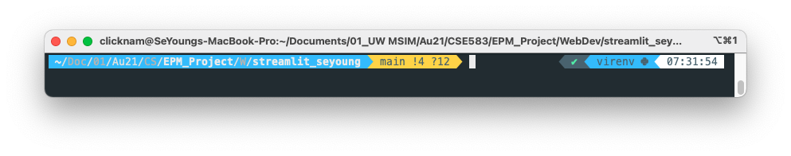

## Set Up Virtual Environment

### Commands

    1. Create a virtuan environment
        * `python3 -m venv virenv`
    2. Confirm that the **virenv** directory is created with bin(or activate), include, lib directories underneath it.
    3.  Activate the virtual environment
        * For Mac/Linux, `source virenv/bin/activate`
        * For Windows, 
            - `source virenv/Scripts/activate`
            - or `virenv/Scripts/activate.bat`
    4. The command line indicates that you are in the virtual environment.
    
    5. Install required libraries for this project.
        * Install required library one by one by the following command.
        `pip install <library_name>`
        * Or create requirements.txt, record a list of required libraries in it like below.
            flask==1.0.1
            requests==x.x.x
            gunicorn==x.x.x
        save it, and enter the following command.
        `pip install -r requirements.txt`
    6. Before pushing your codes to your remote repository, make sure that requirements.txt is created so that a new developer easily install required libraries by typing in `pip install -r requirements.txt`.
        * `pip freeze > requirements.txt`