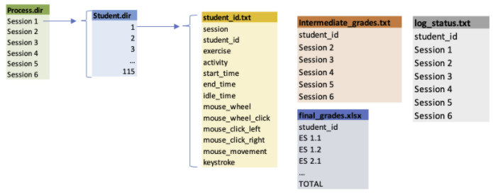

# Functional Specification

Meredith Luo, Seyoung Nam, Yinsheng Kou, Youngwon Kim, Wenjin Zhang|[Team Repo](https://github.com/EPM-LearningAnalytics/EPM_Project)

## **Background:**

It is recognized that online learning is becoming increasingly important. Especially during the COVID-19 pandemic, online learning is indispensable in billions of students’ learning journeys. We see that many online learning platforms have emerged, and there are various ways to record how students interact with these platforms in the form of log data. These log data, which cannot be collected in offline classes, should be helpful for instructors and students to understand the learning progress better. However, due to the complexity of the log data, it is challenging to make them interpretable and meaningful for students and instructors. Therefore, our project intends to build a web tool to make log data, generated from a simulated online electrical engineering course, informative for students and instructors. Using our web tool, students can visualize their learning progress and receive guidance for the course review to boost their final grades. Instructors can better understand their students’ academic performance and easily construct student groups for the group project, which would possibly have a relatively similar academic potential between groups.

## **Data sources:**

**Name**: Educational Process Mining (EPM): A Learning Analytics Data Set

**Source**: ([click here)](https://archive.ics.uci.edu/ml/datasets/Educational+Process+Mining+(EPM)%3A+A+Learning+Analytics+Data+Set)

**Overview**: A group of 115 students of first-year, undergraduate Engineering major at the University of Genoa studied over a simulation environment named Deeds (Digital Electronics Education and Design Suite), and their log activities on the online learning platform, intermediate session grades, and final exam grades are recorded.

**Structure of the data**:

The datasets include the log information, log status, intermediate grades, and final grades of 115 students.

## **User Profile:**

Due to the dataset that we are building models on being **very specific** to the online platform Deeds, our targeted users will be engineering students and instructors who used Deeds for educational purposes. In the future, this web tool can have broader functions to encompass more different online learning platforms.

- For engineering students, their primary goals are
    - to review their learning activities
    - compare their activities with the class average
    - understand how those activities would affect their academic performances.
- Instructors would want to use this tool
    - to get more detailed information about students, not only students’ academic performance but also their behavioral habits
    - To offer customized academic advice to each student.

## **Use cases:**

- **Jenny** is taking the engineering course using Deeds. At the beginning of the course, she was very determined to strengthen her basic knowledge of electronics and complete the course successfully. However, after two months of her study, she found herself not paying enough attention to the course and easily distracted by YouTube videos and social media while taking the course. As the final exam date approaches, she wants to stop her bad habits and set up the course review plan to boost her performance in the final exam. To do so, she signs in to our application, type in her ID, and take a look at her log activities with visual aids. She becomes very embarrassed by the fact that she actually spent more time being idle (meaning she did something else during the study) than time spent studying on the platform. Additionally, she receives recommendations about which chapter she needs to cover first before the final. Because of the recommendation, she successfully completes the course with a much higher score than the class average in the end.

- **Professor Beck** teaches an engineering course this quarter. Near the end of this quarter, he is concerned if students in this course would pass the final. Logging into our web and specifying that he is teacher identity, he can get some plotted view about the student’s logging activities during the past quarter. With a plot about which course recordings are reviewed more frequently, he may have a clear perception about which part of the course makes a bigger impact on the class. He can also identify students who likely fail the course. The prediction is based on our machine learning model. If he focuses on a specific student, he would type in that student’s ID, and our system will output the recordings of his/her logging activities.

## **Software components**

### **1. Visualizations**
* Visualizing students’ learning activities across sessions and comparing individual students’ learning performance with the class average.
* **Input** : Log data will be used for plotting. On the users’ end, students need to provide ID numbers, and instructors need to choose the portal for teachers. Students then can select which session’s activities they want to take a closer look at or compare activities between sessions. Instructors can select which students they want to pay attention to. 
* **Output** : On the HTML page, plots such as line plots, bar charts, and tables displaying descriptive statistics will be generated. 

### **2. Machine learning models**
* **Classification with k Nearest Neighbor(kNN)**
    * We will first aggregate the log activities data into meaningful explanatory variables and select a certain number of variables that are statistically significant to academic performance. Then we will divide three groups( students expected to achieve a low score, mid score, and high score in the final exam) by using the kNN model. This grouping function will ease the instructor’s work to create teams with a similar intellectual capacity by picking a student from three different groups.
* **Log Regression**
    * We want to build a model to tell which section (or chapter) each student has not studied enough and thus needs to review the section before the final exam. For setting the output variable, we assume two scenarios. The first one is a student’s final exam score becomes deteriorated compared to the intermediate test score, which case is assigned 1. The second case is the opposite, meaning that the student’s score is improved. We assign this case to 0. For the input variables, we will process the log activities data, filter out statistically insignificant factors, and retrieve four to five factors with a high potential in explaining the output. 

### **3. Database**
* Log activities data of each student enrolled in the engineering course
* Intermediate grades data
* Final grades data

### **4. A Streamlit page**
* It displays visualizations, a grouping function for team projects, and suggestions for students’ learning/reviewing for the final.
* **Input** : First, they need to specify whether they are students or teachers. Second, if they are students, then they need to provide a student ID. 
* **Output** : For students, they will see visualizations of their individual learning progress and they can compare it with the class average learning activities. They are also able to see based on their current learning activities, what’s the suggestions on reviewing particular sessions could be provided. For teachers, they can see the visualizations of the whole class. They can also zoom in on one particular student. They are also able to group students for class project based on the clustering results.

## **Interactions to accomplish use cases**

Jenny intends to understand her learning progress better and get some advice on the final exam review. She signs in our application by specifying she is a student and providing her student ID. These two inputs from Jenny (i.e., student identity and student ID) satisfied the required inputs for both visualizations and the machine learning engine. On the webpage, various visual aids based on Jenny’s log activities will be generated. The machine learning engine will utilize Jenny’s log activities and predict which performance group Jenny belongs to and whether Jenny needs to review more before the final exam.

## **Preliminary plan**

A list of tasks in priority order
1. Build machine learning models for EDM datasets 
2. Choose the best model for EDM datasets 
3. Search available design mockups of our webtool 
4. Create our webtool’s graphic design
5. Test the webtool
